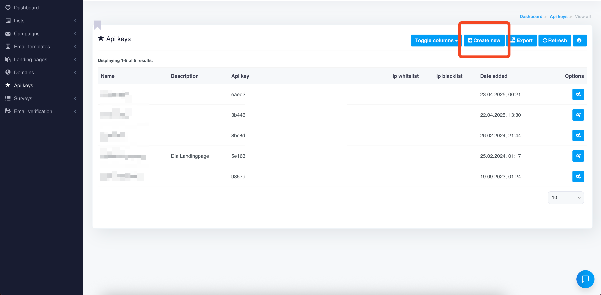

# How to Find Your MailWizz API Key Pair

[English](#english) | [Polski](#polski)

## English

To use the MailWizz node for n8n, you need both the **public** and **private** API keys from your MailWizz system. This document provides step-by-step instructions on how to obtain the key pair.

### Finding the API Key Pair in MailWizz

1. **Log in to your MailWizz admin panel** as an administrator.

2. **Navigate to the API management section**:
   - In the main menu, find and click on `API Keys` or `API Management`
   - Depending on your MailWizz version, it may be listed under `Settings`

3. **Create a new API key** (if you don't have one yet):
   - Click the `Create new API key` button (or similar)
   - Enter a recognizable name for the key (e.g. “n8n Integration”)
   - Set appropriate permissions (for full integration, enabling all relevant permissions is recommended)
   - Save the new key

4. **Copy the key pair**:
   - From the list of existing keys, copy both the **Public key** and the **Private key**
   - Each key is typically a long alphanumeric string; on MailWizz v2 and newer the private key value may match the public key and can be reused interchangeably

### API Key Permissions

For the node to work properly, your key pair should have the following permissions:

- **Campaigns** – create and manage campaigns
- **Lists** – access lists and segments
- **Templates** – read template metadata and content

### API Limits

MailWizz may enforce limits on the number of API requests you can make within a given time window. If you plan to use the API intensively, we recommend:

1. Checking the limits defined in your MailWizz installation
2. Configuring appropriate delays in your n8n workflows
3. Implementing retry mechanisms in case of rate limit responses

### Troubleshooting API Authentication

If you encounter authentication issues:

1. **Ensure the key pair is active** – verify in the MailWizz panel that the keys have not been disabled
2. **Verify the API URL** – it should point to your instance and end with `/api`
3. **Confirm permissions** – an administrator may have restricted permissions for specific keys
4. **Inspect MailWizz logs** – they can provide detailed error information for API requests

### Security

The API key pair provides full access to your MailWizz account, so:

- Store both keys securely
- Never share them with unauthorized individuals
- Consider rotating the keys periodically
- If you suspect compromise, revoke the existing keys and generate new ones immediately

---

## Polski

Aby korzystać z node'a MailWizz dla n8n, potrzebujesz **publicznego** i **prywatnego** klucza API z Twojego systemu MailWizz. Ten dokument zawiera instrukcję krok po kroku, jak uzyskać tę parę kluczy.

### Znajdowanie pary kluczy API w MailWizz

1. **Zaloguj się do panelu administracyjnego MailWizz** jako administrator.

2. **Przejdź do sekcji zarządzania API**:
   - W menu głównym wybierz `API Keys` lub `API Management`
   - W zależności od wersji MailWizz opcja może znajdować się w sekcji `Settings`

3. **Utwórz nowy klucz API** (jeśli jeszcze nie masz):
   - Kliknij przycisk `Create new API key` (lub podobny)
   - Wprowadź nazwę klucza (np. „Integracja n8n”)
   - Ustaw odpowiednie uprawnienia (dla pełnej integracji zalecane są wszystkie potrzebne uprawnienia)
   - Zapisz nowy klucz

4. **Skopiuj parę kluczy**:
   - Z listy istniejących kluczy skopiuj zarówno **Publiczny klucz**, jak i **Prywatny klucz**
   - Każdy z nich to długi ciąg znaków alfanumerycznych; w MailWizz v2 i nowszych wartość klucza prywatnego może być identyczna jak publicznego i można używać jej zamiennie

### Uprawnienia kluczy API

Aby node działał prawidłowo, para kluczy powinna mieć następujące uprawnienia:

- **Campaigns** – tworzenie i zarządzanie kampaniami
- **Lists** – dostęp do list i segmentów
- **Templates** – odczyt metadanych i treści szablonów

### Limity API

MailWizz może ograniczać liczbę zapytań API w określonym przedziale czasu. Jeśli planujesz intensywne użycie API, zalecamy:

1. Sprawdzenie limitów skonfigurowanych w Twojej instalacji MailWizz
2. Ustawienie odpowiednich opóźnień w przepływach pracy n8n
3. Zaimplementowanie mechanizmów ponownych prób w przypadku błędów limitów

### Rozwiązywanie problemów z uwierzytelnianiem API

W przypadku problemów z uwierzytelnianiem:

1. **Sprawdź, czy para kluczy jest aktywna** – w panelu MailWizz upewnij się, że klucze nie zostały dezaktywowane
2. **Zweryfikuj adres URL API** – powinien wskazywać Twoją instancję i kończyć się na `/api`
3. **Potwierdź uprawnienia** – administrator mógł ograniczyć uprawnienia dla konkretnych kluczy
4. **Przejrzyj logi MailWizz** – mogą zawierać szczegółowe informacje o błędach związanych z API

### Bezpieczeństwo

Para kluczy API daje pełny dostęp do Twojego konta MailWizz, dlatego:

- Przechowuj oba klucze w bezpiecznym miejscu
- Nie udostępniaj ich osobom nieupoważnionym
- Rozważ okresową rotację kluczy API
- Jeśli podejrzewasz kompromitację, natychmiast unieważnij klucze i wygeneruj nowe
